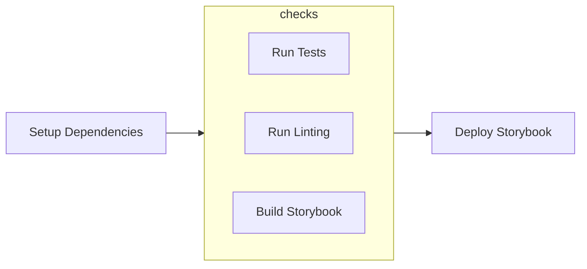

[](https://app.netlify.com/sites/distracted-austin-1da3b5/deploys)


**Deployed Links**
- [Storybook](https://cheyer.github.io/carbon-calc/)
- [App](https://distracted-austin-1da3b5.netlify.app/)

> Simple application to measure carbon emissions. Just add the electricity usage and see the carbon emissions in the graph.


# Getting started

First you need to get an API token from [Carbon Interface](https://www.carboninterface.com/). Then just install the dependencies and run the server with the API token as an environment variable.

```
$ yarn
$ REACT_APP_API_TOKEN=<your-token> yarn start
```

## Storybook

Storybook is used for the purpose of a UI library. A deployed version can be [found here](https://cheyer.github.io/carbon-calc/).
To start storybook simply run:

```
$ yarn storybook
```

## Dependabot

This project uses Dependabot for automatically updating dependencies. However, auto merge is not (yet) enabled.

## CI / CD

This repository includes a CI/CD integration realized with Github Actions, which is triggered by pushing on `main` branch or a PR. It runs a set of checks (tests, linting) before building Storybook and finally deploying Storybook. Storybook is deployed with Github Pages on every push on the branch `main`.

The application itself is being deployed automatically by using the [**Netlify integration**](https://app.netlify.com/sites/distracted-austin-1da3b5/overview). In a next step, the CI/CD pipeline could be improved by only triggering a Netlify deploy, once all the checks have passed.



## Tests

This project uses Jest and React Testing Library. A test example for an utility and a React component can be found in the folder `src/tests/`. As a next step integration tests (e.g. using Cypress) could be introduced. To run the tests simply call `yarn test`.

## Structure

The app is structured as following inside the `src` folder:

```
├── app (basic app and routing)
├── components (UI components)
│   ├── atoms (simple basic components)
│   └── molecules (more complex components consisting of atoms)
├── config (for basic config)
├── mock (for mocks used in test/stories)
├── pages (pages that combine UI components with business logic)
│   ├── <*Page> (Specific page which is rendered inside TemplatePage)
│   └── TemplatePage (Root/Wrapping page structure in which each page is being rendered into)
├── tests (for tests)
├── types (for types)
└──utils (for utility functions)
```

## Technologies Used

- [Create React App](https://create-react-app.dev/docs/getting-started#creating-a-typescript-app) (Typescript template)
- [Axios](https://axios-http.com/) for easier request handling
- [Lodash](https://lodash.com/) for group by function
- [TailwindCSS](https://tailwindcss.com/) for styling the app
- [React Charts](https://react-charts.tanstack.com/) for the graph. Sidenote: Here I'm using the beta version (>3.0.0) as this is not production code and I wanted to try something new.

As the form is really simple no form library was used, instead simply the component's state is used. Also the application itself only uses React Hooks for state, as the example does not require any sophisticated state solution.

## Notes

The list of countries in `src/utils/constants.ts` were taken from the [documentation](https://www.notion.so/4b4f41db73254b4b915ba01d55eba7e7?v=4ad0efe7763540ab801fadd9f3bf1ce0).

## Further Improvements

Since this is just a demo and there is limited time, further things can be introduced / improved:

- End to end test (using e.g. Cypress)
- Visual regression tests (using e.g. Loki)
- i18n
- adding more test, and applying a test coverage treshold
- migrating from Create React App to Next.js
